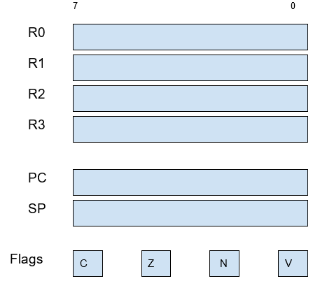
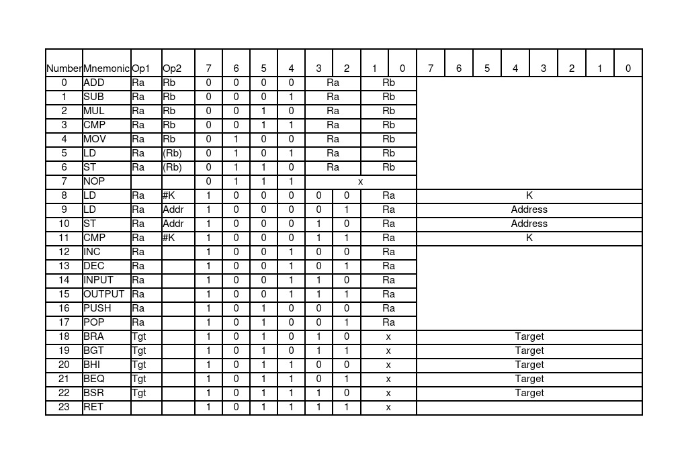
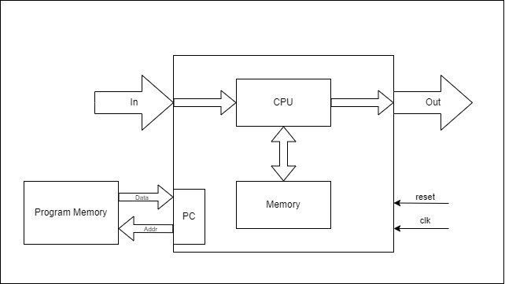

# Design Simple Microprocessor
## Introduction
An 8-bit soft processor written in Verilog.
## CPU Registers
CPU registers are shown below:\
\

- R0 through R3 are general purpose registers.
- PC is the program counter, which always points to the currently running instruction or its argument. The PC is initialized at address 0x00, so all programs must start there.
- SP is the Stack Pointer, which starts pointing to the end of the RAM memory (address 0xFF), as the stack grows towards lower memory locations.\
The stack is used by four instructions: PUSH, POP, BSR, and RET. 
PUSH and POP are used for pushing and popping the general purpose registers to and from the stack, whereas BSR (Branch to SubRoutine) and RET (Return) push and pop the Program Counter respectively.
## Memory Model
CPU implements a Harvard Architecture, meaning that it has two separate addressing spaces for a Program Memory (ROM) and a Data Memory (RAM), both able to store up to 256 bytes. That’s why the PC and SP are both 8-bits wide.\
The Program Memory is Read-Only, and it’s implemented in a separate Verilog Module where programmers can write their code with a reasonably easy syntax.\
The Data Memory is accessible for reading and writing, and it’s implemented inside CPU, so its bus is not accessible to the outside world. Following the RISC philosophy, access to this memory is limited to Load, Store, and Stack instructions (PUSH, POP, BSR, RET).
## I/O Model
CPU has 4 8-bit input ports and 4 8-bit output ports, all with a dedicated strobe output signal. Each Register is tied to one input port and one output port. For example, the incoming data at input port 2 can only enter CPU through register R2, and the outgoing data that must go to output port 0 can only be sent through register R0.\
The strobe outputs signal the external hardware the instant when the data has moved. This signal is a low pulse, where the falling edge indicates the read or write instant.\
An input strobe informs the external hardware that the incoming data has been consumed, so the external hardware may dequeue that value and place a new one, or switch to an end-of-transmission code.\
An output strobe informs the external hardware that the outgoing data has been sent, so the external hardware must consume the data at that instant using the strobe signal as a write input. After the low-pulse in the strobe signal, the data in the output port may change at any time. 
## Addressing Modes
CPU supports the following Addressing Modes:
- Register - For operations between 2 registers, for example ADD R1, R2
- Immediate - For loading and comparing: LD R1, #43   CMP R3, #22
- Direct  - For load and store: LD R3,102   ST R0,0x3F
- Indirect - For load and store: LD R3,(R2)   ST R0,(R1)
- Absolute - For branches, for example BGT 201
- Implicit - No operands: NOP and RET
## Instruction Set Encoding
### Instruction Set Summary:
\

### Instruction Set Details
**Operands**
- Ra	The first register operand for instructions with the register addressing mode.
- Rb	The second register operand for instructions with the register addressing mode.
- K	The immediate argument for instructions with the immediate addressing mode.
- Addr	Address in data memory instructions with the direct addressing mode.
- Tgt	Target address in program memory for instructions with the absolute addressing mode.

**Condition Flags**
- V	Overflow Flag
- N	Negative Flag
- Z	Zero Flag
- C	Carry Bit

**Bit status BEFORE the execution of an instruction**
- An	Bit n of the first operand.
- Bn	Bit n of the second operand.

**Bit status AFTER the execution of an instruction**
- Rn	Bit n of the result of an operation.
## System design
\

## Simulation on Vivado
Add to number A and B. Waveform:
\

